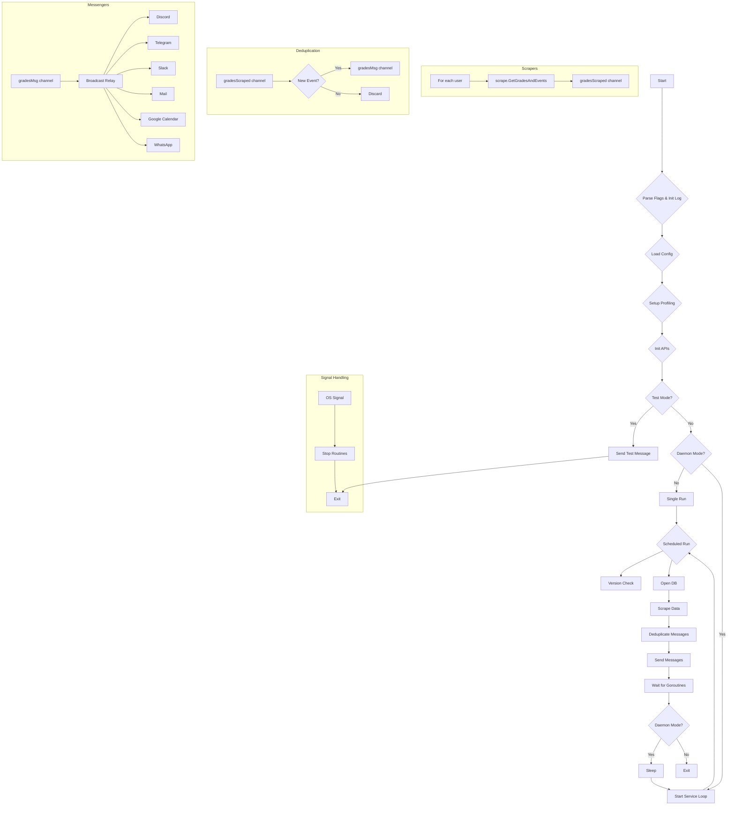

Application flow diagram for the e-dnevnik-bot:

```mermaid
graph TD
    A[Start] --> B{Parse Flags & Init Log};
    B --> C{Load Config};
    C --> D{Setup Profiling};
    D --> E{Init APIs};
    E --> F{Test Mode?};
    F -- Yes --> G[Send Test Message];
    G --> X[Exit];
    F -- No --> H{Daemon Mode?};
    H -- No --> I[Single Run];
    H -- Yes --> J[Start Service Loop];
    I --> K{Scheduled Run};
    J --> K;
    K --> L[Version Check];
    K --> M[Open DB];
    M --> N[Scrape Data];
    N --> O[Deduplicate Messages];
    O --> P[Send Messages];
    P --> Q[Wait for Goroutines];
    Q --> R{Daemon Mode?};
    R -- Yes --> S[Sleep];
    S --> J;
    R -- No --> T[Exit];
    subgraph Scrapers
        N1[For each user] --> N2[scrape.GetGradesAndEvents];
        N2 --> N3[gradesScraped channel];
    end
    subgraph Deduplication
        O1[gradesScraped channel] --> O2{New Event?};
        O2 -- Yes --> O3[gradesMsg channel];
        O2 -- No --> O4[Discard];
    end
    subgraph Messengers
        P1[gradesMsg channel] --> P2[Broadcast Relay];
        P2 --> P3[Discord];
        P2 --> P4[Telegram];
        P2 --> P5[Slack];
        P2 --> P6[Mail];
        P2 --> P7[Google Calendar];
        P2 --> P8[WhatsApp];
    end
    subgraph Signal Handling
        Z[OS Signal] --> Y[Stop Routines];
        Y --> X;
    end
```
